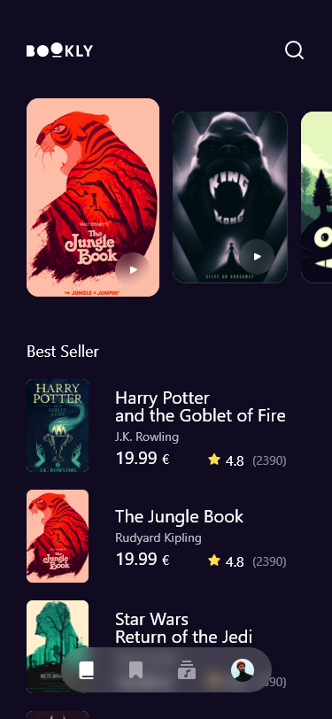

# clean_arch_bookly_app

Welcome to the **clean_arch_bookly_app**, an innovative Flutter project dedicated to offering a seamless and captivating experience for exploring books sourced from the Google Books API. This project embraces a dark theme to provide an immersive reading environment and implements robust Flutter architecture following Clean Architecture principles with the Repository pattern.

> **Note:** This project is intended for learning and practicing Clean Architecture principles and is not suitable for production or deployment.

## Screenshots

### Dark Theme

<div align="center">
      
    
</div>

## Project Overview

### Features

- **Book Exploration:** Seamlessly browse a vast collection of books sourced from the Google Books API.
- **Dark Theme:** Immerse yourself in an optimal reading environment with the exclusively designed dark theme.
- **Book Details:** Access detailed information about each book, including synopsis, author details, and reviews.
- **Book Preview:** Preview select pages of a book to get a glimpse before making a choice.
- **Pagination:** Efficiently navigate through large sets of data with seamless pagination.
- **Search Functionality:** Easily search for specific books or authors within the app.
- **Favorites:** Save your favorite books for quick access later.

### Tech Stack

- **Flutter:** Harness the power of Flutter for cross-platform mobile development, ensuring a smooth and consistent experience.
- **Clean Architecture:** Implement a scalable and maintainable codebase with Clean Architecture principles, dividing the project into distinct layers (Presentation, Domain, Data).
- **MVVM Architecture:** Incorporate the Model-View-ViewModel design pattern within the Clean Architecture for organized and easily maintainable code.
- **Repository Pattern:** Use the Repository pattern to abstract the data layer, providing a clean API for data access and manipulation.
- **State Management:** Utilize efficient state management techniques for handling application state in a streamlined manner.
- **Google Books API Integration:** Seamlessly integrate and retrieve book data from the Google Books API using efficient network requests.
- **SOLID Principles:** Adhere to SOLID principles to ensure a robust and maintainable software architecture.

### Project Structure

The project is divided into three main layers as per Clean Architecture principles:

1. **Presentation Layer:** Contains the UI code and state management.
   - **View:** Widgets and screens.
   - **ViewModel:** Handles the presentation logic and interacts with the Use Cases.
2. **Domain Layer:** Contains the business logic of the application.
   - **Entities:** The core classes of the application.
   - **Use Cases:** Interactors that contain the business logic and are called by the ViewModel.
3. **Data Layer:** Manages data sources and repositories.
   - **Repositories:** Interfaces defining the data operations.
   - **Data Sources:** Implementations of data operations (e.g., API calls, local database).

## Getting Started

To get a local copy of the project up and running, follow these simple steps.

### Prerequisites

- Flutter SDK
- Android Studio / Visual Studio Code

### Installation

1. Clone the repo

   ```sh
   git clone https://github.com/your-username/clean_arch_bookly_app.git
   ```

2. Install Flutter packages

   ```sh
   flutter pub get
   ```

3. Run the app

   ```sh
   flutter run
   ```

## Usage

- Browse through the list of books.
- Click on a book to view its details.
- Use the search bar to find specific books or authors.
- Add books to your favorites list for quick access.

## Contributing

Contributions are what make the open-source community such an amazing place to learn, inspire, and create. Any contributions you make are **greatly appreciated**.

1. Fork the Project
2. Create your Feature Branch (`git checkout -b feature/AmazingFeature`)
3. Commit your Changes (`git commit -m 'Add some AmazingFeature'`)
4. Push to the Branch (`git push origin feature/AmazingFeature`)
5. Open a Pull Request

---

## Last Updated: 2023-07-09
